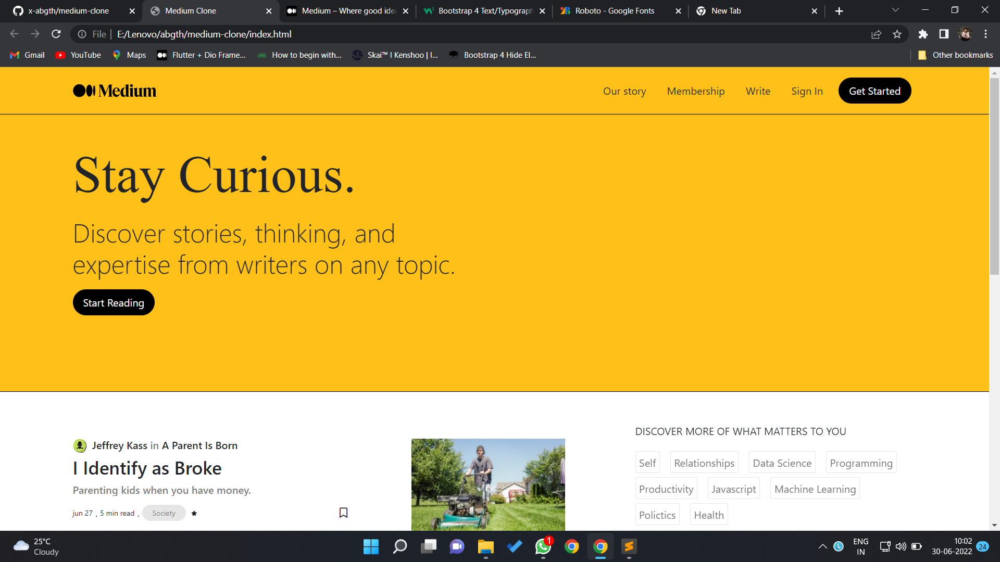
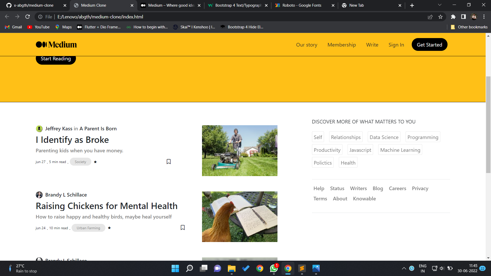
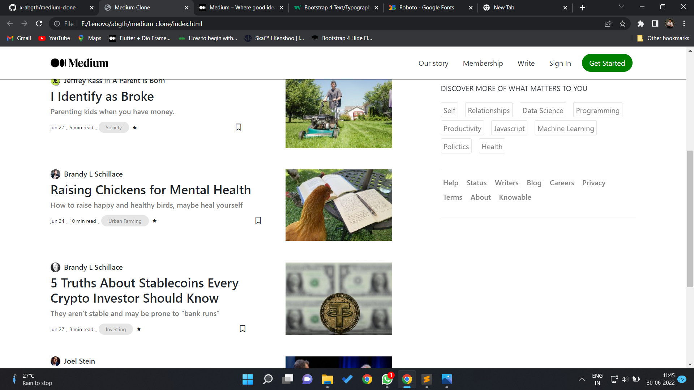

# Stack Overflow web application clone
This is a clone application of [Medium](https://medium.com/) website, made for educational purpose only.

## See live demo [**HERE**](https://x-abgth.github.io/medium-clone/)
<br><br>
>This application is only developed on front end and currently not responsive.

## 📱 Screenshots
 
 
 

## 💻 Test application on your machine
Open CMD from where you want to clone the project & run the following commands:
```
  git clone https://github.com/x-abgth/medium-clone.git
```
```
  cd medium-clone/lib/index.html
 ```
 
## ❤ Conclusion
🌟 Star this repo & follow for more 😊